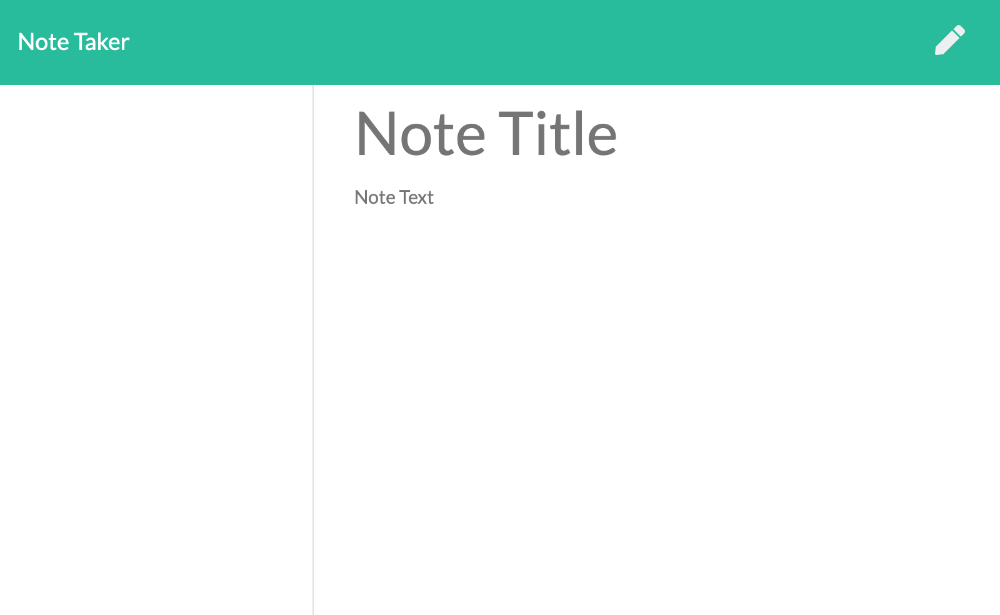

# Note-Taker
An application that can write, save, and delete notes. This application uses an express backend and saves and retrieves note data from a JSON file

[Note Taker App](https://skylerdakota.github.io/Note-Taker/)



#### Table of Contents

1. [Project Description](#project-description)
2. [Installation Instructions](#installation-instructions)
3. [Usage Information](#usage-information)
4. [Contributor Guidelines](#contributor-guidelines)
5. [Code of Conduct](#code-of-conduct)
6. [Test Instructions](#test-instructions)
7. [License](#license)
8. [Questions](#questions)

#### Project Description

* This project is an application that can write, save, and delete notes. This application uses an express backend and saves and retrieves note data from a JSON file.

#### Installation Instructions

* This app requires installing all npm node.js packages to run.

#### Usage Information

* The application will be invoked by using the following command when in the appropriate directory:

```
node server.js
```

#### Contributor Guidelines

* Contributions are welcome please follow the code of conduct (see below)

#### Code of Conduct

* [Contributor Covenant Code of Conduct](https://www.contributor-covenant.org/version/2/0/code_of_conduct/code_of_conduct.md)

#### Test Instructions

* No tests at this time

#### License

* licensed under the [MIT License](Develop/LICENSE.txt)

#### Questions

* [Skyler Dakota's GitHub Page](http://github.com/skylerdakota)
* skylerdakota@gmail.com